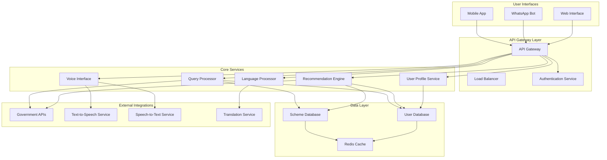

# Design Document: SahayAI

## Overview

SahayAI is designed as a microservices-based, cloud-native AI assistant that democratizes access to government welfare schemes across India. The system leverages modern NLP technologies, specifically optimized for Indian languages, and provides multiple interaction channels including voice, text, mobile apps, and WhatsApp integration.

The architecture follows a layered approach with clear separation between user interfaces, AI processing, data management, and external integrations. This design ensures scalability, maintainability, and the ability to integrate with India's Digital Public Infrastructure (DPI) ecosystem including API Setu and other government platforms.

## Architecture

### High-Level Architecture



### Service Architecture Patterns

The system employs several architectural patterns:

1. **Microservices Architecture**: Each core functionality is isolated in independent services
2. **API Gateway Pattern**: Single entry point for all client requests with routing, authentication, and rate limiting
3. **CQRS Pattern**: Separate read and write operations for optimal performance
4. **Event-Driven Architecture**: Asynchronous communication between services using message queues
5. **Circuit Breaker Pattern**: Fault tolerance for external API integrations

## Components and Interfaces

### Core Services

#### Query Processor Service
**Responsibility**: Natural language understanding and intent recognition
- **Input**: Raw user queries in multiple languages
- **Output**: Structured intent with extracted entities
- **Technology**: Transformer-based models fine-tuned for Indian languages
- **Key Features**:
  - Multi-language query understanding
  - Entity extraction (age, location, occupation, income)
  - Intent classification (scheme search, eligibility check, application status)
  - Context maintenance across conversation turns

#### Language Processor Service
**Responsibility**: Multi-language support and translation
- **Input**: Text in various Indian languages
- **Output**: Processed text in target language
- **Technology**: IndicBERT-based models with custom fine-tuning
- **Key Features**:
  - Support for 10+ Indian languages
  - Code-mixing handling
  - Cultural context preservation
  - Terminology consistency across languages

#### Voice Interface Service
**Responsibility**: Speech-to-text and text-to-speech conversion
- **Input**: Audio streams or text
- **Output**: Transcribed text or synthesized speech
- **Technology**: IndicParlerTTS for TTS, Whisper-based models for STT
- **Key Features**:
  - Multi-language speech recognition
  - Natural-sounding speech synthesis
  - Noise reduction and audio preprocessing
  - Accent and dialect handling

#### Recommendation Engine Service
**Responsibility**: Personalized scheme matching and ranking
- **Input**: User profile and query context
- **Output**: Ranked list of relevant schemes
- **Technology**: Machine learning models with collaborative filtering
- **Key Features**:
  - Eligibility-based filtering
  - Benefit value optimization
  - Application deadline awareness
  - Historical success rate consideration

#### User Profile Service
**Responsibility**: User data management and privacy protection
- **Input**: User demographic and preference data
- **Output**: Structured user profiles
- **Technology**: Encrypted database with GDPR-compliant data handling
- **Key Features**:
  - Secure data storage
  - Profile versioning
  - Consent management
  - Data portability and deletion

### External Integrations

#### Government API Integration Layer
**Purpose**: Connect with official government systems
- **API Setu Integration**: Leverage India's unified API gateway
- **State Government APIs**: Direct integration with state-specific systems
- **Real-time Data Sync**: Automatic updates from government databases
- **Authentication**: OAuth 2.0 and API key management
- **Rate Limiting**: Respect government API quotas and throttling

#### WhatsApp Business API Integration
**Purpose**: Enable WhatsApp-based interactions
- **Message Handling**: Process text, voice, and media messages
- **Session Management**: Maintain conversation context
- **Template Messages**: Use approved templates for notifications
- **Media Support**: Handle document sharing and voice notes
- **Webhook Processing**: Real-time message processing

## Data Models

### User Profile Model
```typescript
interface UserProfile {
  userId: string;
  demographics: {
    age: number;
    gender: 'male' | 'female' | 'other' | 'prefer_not_to_say';
    location: {
      state: string;
      district: string;
      pincode: string;
    };
    occupation: string;
    incomeLevel: 'below_poverty_line' | 'low_income' | 'middle_income' | 'high_income';
    educationLevel: string;
    familySize: number;
  };
  preferences: {
    preferredLanguage: string;
    communicationMode: 'voice' | 'text' | 'both';
    notificationSettings: NotificationSettings;
  };
  applicationHistory: ApplicationRecord[];
  createdAt: Date;
  updatedAt: Date;
  consentGiven: boolean;
}
```

### Scheme Model
```typescript
interface GovernmentScheme {
  schemeId: string;
  name: {
    [language: string]: string;
  };
  description: {
    [language: string]: string;
  };
  category: 'education' | 'healthcare' | 'employment' | 'agriculture' | 'social_welfare';
  eligibilityCriteria: {
    ageRange?: { min: number; max: number };
    genderRequirement?: string[];
    incomeLimit?: number;
    locationRestrictions?: string[];
    occupationRequirements?: string[];
    educationRequirements?: string[];
    customCriteria?: EligibilityCriterion[];
  };
  benefits: {
    [language: string]: string;
  };
  applicationProcess: {
    [language: string]: ApplicationStep[];
  };
  requiredDocuments: {
    [language: string]: string[];
  };
  deadlines: {
    applicationStart?: Date;
    applicationEnd?: Date;
    renewalDate?: Date;
  };
  contactInformation: ContactInfo;
  governmentLevel: 'central' | 'state' | 'district' | 'local';
  isActive: boolean;
  lastUpdated: Date;
}
```

### Conversation Context Model
```typescript
interface ConversationContext {
  sessionId: string;
  userId: string;
  platform: 'mobile_app' | 'whatsapp' | 'web';
  currentIntent: string;
  extractedEntities: { [key: string]: any };
  conversationHistory: Message[];
  userProfile: UserProfile;
  recommendedSchemes: string[];
  currentStep: string;
  language: string;
  createdAt: Date;
  lastActivity: Date;
}
```

### Query Processing Model
```typescript
interface ProcessedQuery {
  originalQuery: string;
  language: string;
  intent: {
    primary: string;
    confidence: number;
    alternatives: IntentAlternative[];
  };
  entities: {
    location?: string;
    age?: number;
    occupation?: string;
    schemeCategory?: string;
    timeframe?: string;
  };
  sentiment: 'positive' | 'neutral' | 'negative';
  urgency: 'low' | 'medium' | 'high';
  requiresClarification: boolean;
  suggestedFollowUp: string[];
}
```

Now I need to use the prework tool to analyze the acceptance criteria before writing the Correctness Properties section.
## Correctness Properties

*A property is a characteristic or behavior that should hold true across all valid executions of a system—essentially, a formal statement about what the system should do. Properties serve as the bridge between human-readable specifications and machine-verifiable correctness guarantees.*

### Property 1: Multi-language Processing Consistency
*For any* supported Indian language (Hindi, Bengali, Telugu, Marathi, Tamil, Gujarati, Urdu, Kannada, Odia, Malayalam), the system should correctly process queries, provide responses, and convert between speech and text in that language
**Validates: Requirements 1.1, 2.1, 3.1**

### Property 2: Language Selection Persistence
*For any* user session, when a language is selected, all subsequent interactions should maintain that language consistently across query processing and response generation
**Validates: Requirements 1.2**

### Property 3: Translation Accuracy Preservation
*For any* government scheme information, when translated between supported languages, critical eligibility criteria and application procedures should be semantically equivalent
**Validates: Requirements 1.3**

### Property 4: Code-mixing Query Understanding
*For any* query containing multiple Indian languages (code-mixing), the system should correctly extract intent and entities regardless of language boundaries
**Validates: Requirements 1.4**

### Property 5: Cross-modal Context Preservation
*For any* conversation, switching between voice and text interaction modes should preserve all conversation context and user state
**Validates: Requirements 2.5**

### Property 6: Natural Language Intent Recognition
*For any* natural language query about welfare schemes in supported languages, the system should correctly identify the user's intent and extract relevant entities (age, occupation, location, income)
**Validates: Requirements 3.1, 3.4**

### Property 7: Colloquial Term Mapping
*For any* query using colloquial or informal terms, the system should correctly map these terms to appropriate scheme categories and eligibility factors
**Validates: Requirements 3.2**

### Property 8: Scheme Name Variation Recognition
*For any* government scheme, the system should recognize and respond correctly to common variations, abbreviations, and alternative names of that scheme
**Validates: Requirements 3.5**

### Property 9: Comprehensive Profile Management
*For any* user profile update, the system should store all demographic information securely, allow modifications at any time, and immediately reflect changes in future recommendations
**Validates: Requirements 4.1, 4.2, 4.3**

### Property 10: Profile-based Eligibility Matching
*For any* user profile and government scheme, the recommendation engine should only suggest schemes where the user meets all eligibility criteria based on their complete profile
**Validates: Requirements 4.4, 6.1**

### Property 11: Privacy and Security Compliance
*For any* user data, the system should encrypt personal information during storage and transmission, and successfully delete all user data when requested
**Validates: Requirements 4.5**

### Property 12: Comprehensive Scheme Database Coverage
*For any* scheme category (education, healthcare, employment, agriculture, social welfare), the database should contain schemes with complete information including eligibility criteria, documents, procedures, and benefits
**Validates: Requirements 5.1, 5.3**

### Property 13: Location-specific Scheme Handling
*For any* government scheme with state or regional variations, the system should provide location-appropriate information based on the user's location
**Validates: Requirements 5.4**

### Property 14: Historical Data Preservation
*For any* scheme modification or deadline change, the system should maintain historical records while updating current information
**Validates: Requirements 5.5**

### Property 15: Recommendation Ranking and Explanation
*For any* set of eligible schemes for a user, the system should rank them by relevance and benefit value, and provide clear explanations for why each scheme is recommended
**Validates: Requirements 6.2, 6.3**

### Property 16: Dynamic Recommendation Updates
*For any* change in user profile or circumstances, the recommendation engine should update suggestions accordingly and avoid recommending schemes already applied for
**Validates: Requirements 6.4, 6.5**

### Property 17: Bandwidth Optimization
*For any* data transmission, the system should apply compression to minimize bandwidth usage while maintaining data integrity
**Validates: Requirements 7.1**

### Property 18: Local Caching Functionality
*For any* frequently accessed scheme information, the system should cache data locally and provide offline access to cached content
**Validates: Requirements 7.3**

### Property 19: Accessibility Feature Support
*For any* user interface element, the system should support large text options, high contrast modes, and assistive technology compatibility
**Validates: Requirements 8.1, 8.5**

### Property 20: Simple Language Usage
*For any* system response or interaction, the language should be simple, clear, and free of technical jargon
**Validates: Requirements 8.2**

### Property 21: Helpful Error Guidance
*For any* user input error, the system should provide constructive guidance rather than technical error messages
**Validates: Requirements 8.3**

### Property 22: Cross-platform Feature Parity
*For any* core SahayAI functionality, it should work consistently across mobile app and WhatsApp interfaces
**Validates: Requirements 9.2**

### Property 23: Multimedia Message Handling
*For any* multimedia message (voice notes, images, documents) sent through WhatsApp, the system should process and respond appropriately
**Validates: Requirements 9.3**

### Property 24: Cross-platform Data Synchronization
*For any* user switching between mobile app and WhatsApp platforms, conversation history, user profiles, and context should be synchronized seamlessly
**Validates: Requirements 9.4, 9.5**

### Property 25: Government API Integration Resilience
*For any* government API integration, the system should handle varying response times, temporary unavailability, and authentication requirements gracefully while maintaining functionality
**Validates: Requirements 10.2, 10.3, 10.4**

### Property 26: Backward Compatibility Preservation
*For any* new government service integration, existing functionality should continue to work without degradation
**Validates: Requirements 10.5**

## Error Handling

### Error Categories and Strategies

#### Language Processing Errors
- **Speech Recognition Failures**: Implement confidence thresholds and request clarification for low-confidence transcriptions
- **Translation Errors**: Maintain fallback to original language with explanation when translation fails
- **Code-mixing Complexity**: Use language detection confidence scores to handle ambiguous mixed-language input

#### External Service Failures
- **Government API Unavailability**: Implement circuit breaker pattern with cached data fallback
- **WhatsApp API Limits**: Queue messages and implement exponential backoff for rate limiting
- **Network Connectivity Issues**: Graceful degradation to cached content with clear user communication

#### Data Integrity Issues
- **Profile Corruption**: Implement data validation and recovery from backup profiles
- **Scheme Information Inconsistency**: Automated data validation with manual review triggers
- **Cache Invalidation**: Time-based and event-driven cache refresh strategies

#### User Experience Errors
- **Ambiguous Queries**: Structured clarification questions with multiple choice options
- **Accessibility Failures**: Automatic fallback to basic accessibility modes
- **Platform Switching Issues**: Robust session management with conflict resolution

### Error Recovery Mechanisms

1. **Graceful Degradation**: System continues operating with reduced functionality when components fail
2. **Automatic Retry**: Exponential backoff for transient failures with maximum retry limits
3. **User Communication**: Clear, non-technical explanations of issues and suggested actions
4. **Fallback Modes**: Alternative interaction methods when primary channels fail
5. **Data Recovery**: Automated backup and restore procedures for critical user data

## Testing Strategy

### Dual Testing Approach

The testing strategy employs both unit testing and property-based testing as complementary approaches:

- **Unit Tests**: Focus on specific examples, edge cases, integration points, and error conditions
- **Property Tests**: Verify universal properties across all inputs through randomized testing
- **Integration Tests**: Validate end-to-end workflows across multiple services
- **Performance Tests**: Ensure system meets latency and throughput requirements under load

### Property-Based Testing Configuration

**Technology Stack**: 
- **Python**: Hypothesis library for property-based testing
- **TypeScript/JavaScript**: fast-check library for property-based testing
- **Test Configuration**: Minimum 100 iterations per property test to ensure comprehensive coverage

**Test Tagging**: Each property-based test must include a comment referencing the design document property:
```
# Feature: sahay-ai, Property 1: Multi-language Processing Consistency
```

**Property Test Implementation**: Each correctness property listed above must be implemented as a single property-based test that validates the universal behavior across randomized inputs.

### Unit Testing Focus Areas

Unit tests should concentrate on:
- **Specific Language Examples**: Test known challenging cases for each supported language
- **Edge Cases**: Boundary conditions for user profiles, scheme eligibility, and data limits
- **Error Conditions**: Specific failure scenarios and recovery mechanisms
- **Integration Points**: Service-to-service communication and external API interactions
- **Security Scenarios**: Authentication, authorization, and data protection edge cases

### Testing Infrastructure

- **Continuous Integration**: Automated test execution on code changes
- **Test Data Management**: Synthetic data generation for privacy-compliant testing
- **Performance Monitoring**: Automated performance regression detection
- **Accessibility Testing**: Automated accessibility compliance verification
- **Multi-language Testing**: Comprehensive coverage across all supported Indian languages
## Deployment Overview

SahayAI will be deployed on a cloud-native infrastructure using containerization (Docker) and orchestration (Kubernetes), enabling scalability across regions and languages. CI/CD pipelines ensure rapid iteration and compliance with government data handling standards.
